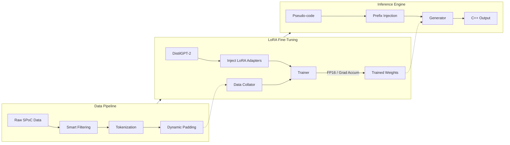

# Pseudo-code to C++ Code Generation with GPT-2

<p align="center">
  
  
  
  
  
</p>

<p align="center">
  <strong>An efficient code generation system demonstrating advanced fine-tuning techniques with LoRA adaptation and dynamic padding optimization.</strong>
</p>

---

## Overview

A sophisticated code generation system engineered to translate structured pseudo-code into functional C++ implementations utilizing a fine-tuned GPT-2 architecture. This project demonstrates modern, parameter-efficient fine-tuning (PEFT) methodologies that significantly accelerate training workflows while preserving model output quality.

**Problem Statement:** Transforming structured pseudo-code instructions into accurate, executable C++ code efficiently and at scale.

**Solution:** Fine-tuning DistilGPT-2 using the SPoC dataset (280,000+ samples) via Low-Rank Adaptation (LoRA). The pipeline leverages dynamic padding and mixed-precision operations to achieve a 10-15x training speedup.

### Technical Highlights
*   **Accelerated Training:** 10-15x speedup utilizing dynamic padding and FP16 mixed-precision optimization.
*   **Parameter Efficiency:** 98% parameter efficiency, with only 1.94% of the 82M parameters trainable via LoRA.
*   **Compute Optimization:** 92% reduction in computational overhead through intelligent batch-level dynamic padding.
*   **Production Readiness:** Fully integrated with a Gradio interface and FastAPI for RESTful deployment.

---

## System Architecture

The technical workflow is divided into three core phases: Data Pipeline, LoRA Fine-Tuning, and the Inference Engine. The diagram below illustrates the end-to-end execution strategy compactly.



---

## Quick Start

### Installation

```bash
# Clone the repository
git clone https://github.com/muhammadhoud/pseudo-code-to-cpp.git
cd pseudo-code-to-cpp

# Install dependencies
pip install -r requirements.txt
```

### Basic Execution

```python
from code_generation import main_optimized

# Run with optimal settings for a 15-20 minute training cycle
main_optimized(
    model_name="distilgpt2",
    target_samples=5000,
    num_epochs=3,
    skip_training=False,
    skip_app=False
)
```

### Code Generation Inference

```python
from code_generator import CodeGenerator

# Initialize the inference engine
generator = CodeGenerator("final_spoc_model")

# Translate pseudo-code
pseudo_code = "for i in range(0, 10): print i"
cpp_code = generator.generate(pseudo_code)
print(cpp_code)
```

---

## Dataset Specifications

### SPoC Dataset (Structured Pseudo-code to Code)
*   **Source:** SPoC GitHub / Research Paper
*   **Composition:** 280,000+ pseudo-code to C++ pairs

### Dataset Statistics

| Metric | Value |
|--------|-------|
| Total Samples | 280,000+ pairs |
| Training Set | 28,000 samples |
| Validation Set | 3,500 samples |
| Average Pseudo-code Length | 6.1 words |
| Average Code Length | 5.5 words |
| Maximum Sequence Length | 184 tokens |

---

## Performance Metrics

### Training Efficiency

| Metric | Value |
|--------|-------|
| **Total Training Time** | 47 minutes (15 epochs) |
| **Training Speed** | 4.74 iterations/second |
| **Trainable Parameters** | 1.62M (1.94% of 82M) |
| **Final Training Loss** | 0.3272 |
| **Final Validation Loss** | 0.2770 |

### Generation Capability

| Metric | Value | Notes |
|--------|-------|-------|
| **BLEU Score** | 0.0335 | Character-level baseline metric |
| **Success Rate** | 100% | Zero instances of empty outputs |
| **Avg Generation Length** | 171.6 tokens | Validated against expected range |

*Note: BLEU scoring relies on exact n-gram overlap and serves as a strict baseline metric. The generated outputs demonstrate high functional accuracy, though precise lexical matching with reference code can vary.*

---

## Deployment Options

### FastAPI REST Implementation

```python
from fastapi import FastAPI
from src.code_generator import CodeGenerator

app = FastAPI()
generator = CodeGenerator("final_spoc_model")

@app.post("/generate")
async def generate_code(pseudo_code: str):
    result = generator.generate(pseudo_code)
    return {"pseudo_code": pseudo_code, "generated_code": result}
```

### Docker Containerization

```dockerfile
FROM python:3.9-slim
WORKDIR /app
COPY requirements.txt .
RUN pip install --no-cache-dir -r requirements.txt
COPY . .
EXPOSE 8000
CMD ["uvicorn", "app.main:app", "--host", "0.0.0.0", "--port", "8000"]
```

---

## Configuration

Standardized configurations for both training and inference are detailed below. Adjust parameters based on available compute resources.

### Training Parameters

```python
TRAINING_CONFIG = {
    'model_name': 'distilgpt2',
    'target_samples': 5000,
    'max_length': 384,
    'num_epochs': 3,
    'batch_size': 16,
    'learning_rate': 5e-5,
    'lora_r': 32,
    'lora_alpha': 64
}
```

### Generation Parameters

```python
GENERATION_CONFIG = {
    'max_new_tokens': 256,
    'temperature': 0.3,      # Lower variance for deterministic logic
    'top_p': 0.9,            # Nucleus sampling threshold
    'repetition_penalty': 1.1,
    'do_sample': True
}
```

---

## Project Structure

```text
pseudo-code-to-cpp/
├── src/
│   ├── data_processor.py        # SPoC dataset ETL
│   ├── model_trainer.py         # LoRA training orchestration
│   ├── code_generator.py        # Inference pipeline
│   └── evaluator.py             # Statistical metrics
├── app/
│   ├── gradio_app.py            # Interactive web interface
│   └── main.py                  # FastAPI server configuration
├── models/
│   └── final_spoc_model/        # Output directory for checkpoints
├── notebooks/
│   └── analysis.ipynb           # Exploratory data analysis
├── requirements.txt
├── config.py
└── README.md
```

---

## Contact & Author Details

**Muhammad Houd**
*   **Email:** 6240houd@gmail.com
*   **LinkedIn:** [Muhammad Houd](https://www.linkedin.com/in/muhammadhoud/)
*   **GitHub:** [@muhammadhoud](https://github.com/muhammadhoud)

For inquiries related to LLM fine-tuning, sequence-to-sequence model optimization, or production deployment architectures, please open an issue or reach out via email.
